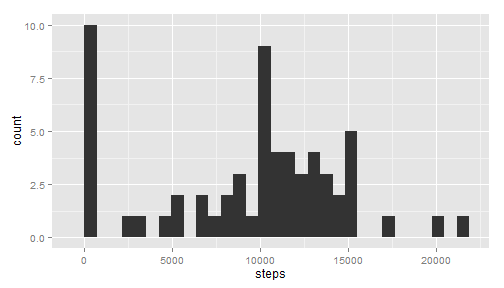
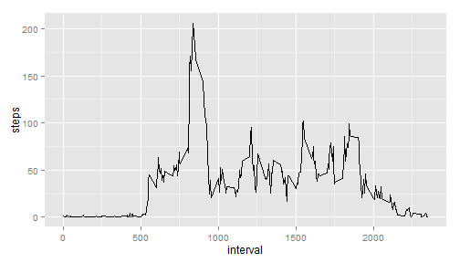
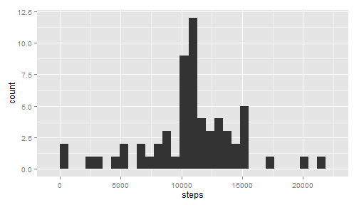
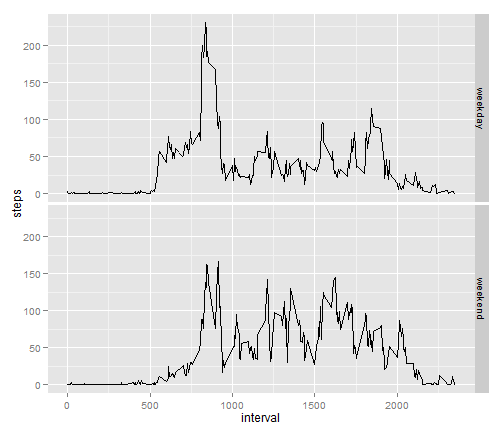

# Reproducible Research: Peer Assessment 1

In this assignment, personal activity monitoring data (steps per 5-minute interval) is analyzed for an individual over 61 days.

## Loading and preprocessing the data
First, the data must be read in.

```r
activity <- read.csv('.\\activity\\activity.csv')
```
Taking a quick look at the data, there is cause for concern about the amount of missing data in the "steps" variable:

```r
head(activity)
```

```
##   steps       date interval
## 1    NA 2012-10-01        0
## 2    NA 2012-10-01        5
## 3    NA 2012-10-01       10
## 4    NA 2012-10-01       15
## 5    NA 2012-10-01       20
## 6    NA 2012-10-01       25
```
However, a quick look at basic summary statistics is reassuring (and perhaps it's not too surprising the device isn't monitoring during the first several minutes after midnight):

```r
summary(activity)
```

```
##      steps               date          interval   
##  Min.   :  0.0   2012-10-01:  288   Min.   :   0  
##  1st Qu.:  0.0   2012-10-02:  288   1st Qu.: 589  
##  Median :  0.0   2012-10-03:  288   Median :1178  
##  Mean   : 37.4   2012-10-04:  288   Mean   :1178  
##  3rd Qu.: 12.0   2012-10-05:  288   3rd Qu.:1766  
##  Max.   :806.0   2012-10-06:  288   Max.   :2355  
##  NA's   :2304    (Other)   :15840
```
A structural summary of the data shows another cause for concern:

```r
str(activity)
```

```
## 'data.frame':	17568 obs. of  3 variables:
##  $ steps   : int  NA NA NA NA NA NA NA NA NA NA ...
##  $ date    : Factor w/ 61 levels "2012-10-01","2012-10-02",..: 1 1 1 1 1 1 1 1 1 1 ...
##  $ interval: int  0 5 10 15 20 25 30 35 40 45 ...
```
The date is coded as a factor, which makes it somewhat harder to work with. Converting to dates solves this problem.

```r
activity$date <- as.Date(activity$date)
```

## What is mean total number of steps taken per day?
A histogram of daily total steps will show how the steps taken varies by day. First, the data must be summarized to the level of the date.

```r
library(plyr)
activityByDate <- ddply(activity, "date", summarize, steps = sum(steps, na.rm = TRUE))
```
Now the histogram can be generated.

```r
library(ggplot2)
qplot(steps, data=activityByDate,geom="histogram")
```

```
## stat_bin: binwidth defaulted to range/30. Use 'binwidth = x' to adjust this.
```

 

The plot has two obvious spikes: at 0 and at 10,000.

Calculating the central tendency:

```r
mean(activityByDate$steps, na.rm=TRUE)
```

```
## [1] 9354
```

```r
median(activityByDate$steps, na.rm=TRUE)
```

```
## [1] 10395
```
The presence of the zeros is skewing the mean to the left of the median.

## What is the average daily activity pattern?
In order to look at the trend within days, the data must be summarized across the dates.

```r
activityByInterval <- ddply(activity, "interval", summarize, steps = mean(steps, na.rm = TRUE))
```
Looking at this data by time of day:

```r
qplot(interval, steps, data=activityByInterval, geom="line")
```

 

There is a big spike around 8am and erratic activity in the evening.

## Imputing missing values
So far missing data has simply been ignored, but there is reason to worry it may be affecting the analysis. Also available above, the number of missing values in the original dataset is:

```r
sum(is.na(activity$steps))
```

```
## [1] 2304
```
A decent first-order imputation would be to replace the missing values with the average value for that interval across all days. This is intuitive because we would expect the variation in steps by the time within a day to be greater than the variation between days.

```r
activityImputed <- ddply(activity, "interval", function(df) {df$steps[is.na(df$steps)] <- mean(df$steps, na.rm=TRUE); return(df)})
```
Checking to make sure the missing values were eliminated:

```r
sum(is.na(activityImputed))
```

```
## [1] 0
```
Now, to summarize as above:

```r
activityByDateImputed <- ddply(activityImputed, "date", summarize, steps = sum(steps))
qplot(steps, data=activityByDateImputed,geom="histogram")
```

```
## stat_bin: binwidth defaulted to range/30. Use 'binwidth = x' to adjust this.
```

 

The zero spike from before disappears and moves the peak to slightly above 10,000.

Calculating the central tendency:

```r
mean(activityByDateImputed$steps)
```

```
## [1] 10766
```

```r
median(activityByDate$steps)
```

```
## [1] 10395
```
The mean went up by 1,400 steps but the median was unaffected. Filling in the missing values brought up most of the zero values and completely eliminated the left-skew from before.

## Are there differences in activity patterns between weekdays and weekends?
First, the imputed data needs to be separated into weekdays and weekends.

```r
activityImputed$dayOfWeek <- weekdays(activityImputed$date)
activityImputed$weekday[activityImputed$dayOfWeek %in% c("Monday","Tuesday","Wednesday","Thursday","Friday")] <- "weekday"
activityImputed$weekday[activityImputed$dayOfWeek %in% c("Saturday","Sunday")] <- "weekend"
```
Then the averages can be taken.

```r
activityFinalImputed <- ddply(activityImputed, c("weekday","interval"), summarize, steps = mean(steps))
```
Now the weekdays and weekends can be compared directly.

```r
qplot(interval, steps, data=activityFinalImputed, geom="line", facets=weekday~.)
```

 

Note that the weekend includes fewer early mornings, less activity around 8am, and a late-night spike a little after 10pm.
